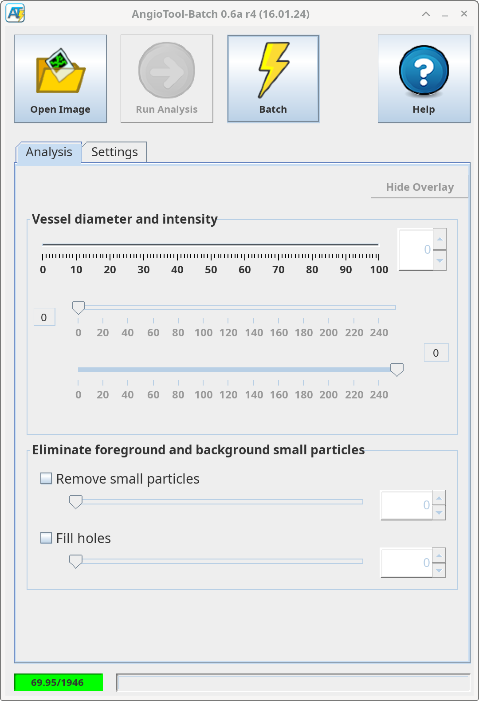
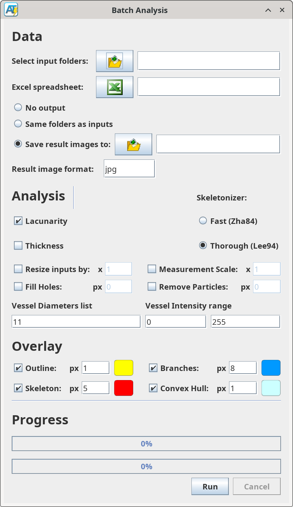

# AngioTool-Batch

This is a modified version of AngioTool 0.6a which adds batch processing.

AngioTool is a program designed to analyse eye scans for potential defects,
using various algorithms to extract data from the scanned image.
It was developed by the Center for Cancer Research from 2011-2014, and is commonly used in the ophthalmology field.

The intended use case was to view and analyse a scanned image, while also saving the results for record keeping and further analysis.
However, in ophthalmology research, it is also used to process large collections of scans.
Since AngioTool only lets the user analyse one scan at a time, this process becomes extremely tedious,
especially when the scanning settings don't need to change.

This version of AngioTool lets the user select one or more folders,
which are recursed fully such that every single non-output image inside those folders
(and the folders inside those folders, and so on) are analysed all in go.
The settings as specified in the user interface are applied to each scan.

To download binaries, check the [Releases](https://github.com/jbendtsen/AngioTool-Batch/releases) tab.
